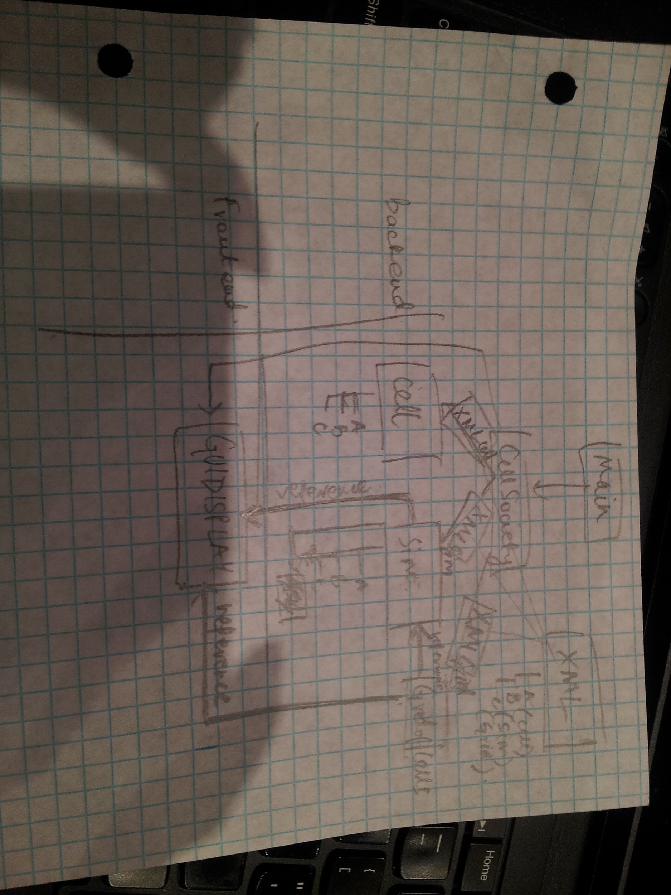
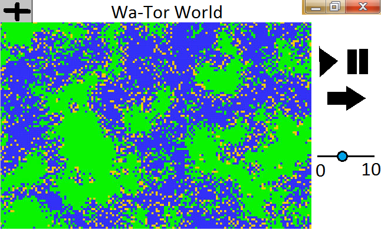
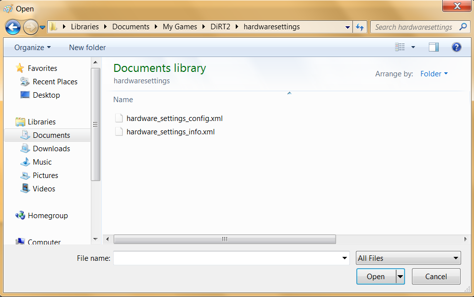
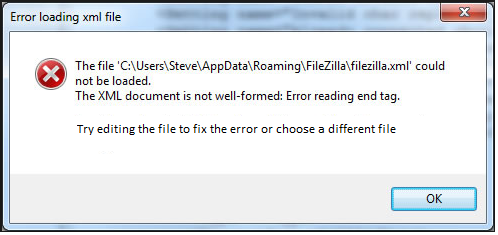

#Introduction

The three main components of this project will be the input parser, the back-end state calculations, and the GUI. The goal of writing this program is to provide a general interface for running different types of cellular automata simulations and displaying the results in a user-friendly manner. In turn, one of our primary design goals of this project is to be able to easily create and run new types of cellular automata simulations, meaning that parsing and generating rules should be flexible, as well that our program should be able to robustly implement these rules in our back-end and draw the results on our display. In other words it is important that the program should easily accept new rules of states and interactions. Another goal is to adhere to good design principles such as avoiding duplicating code, extracting methods to simplify API interfacing, and utilizing polymorphism to also have our project be easily readable and extensible. Our code will be mostly closed, using private instance variables throughout classes with getters and setters as necessary. However, some components will be open in the sense that some classes will be abstract and should be extended in order to implement a new or altered set of specifications. For example, the basic backend classes might be open to extension, but they are closed to modification so that it can provide a consistent interface to process and send data to the display.
#Overview

The Main class has some basic functionality like setting up the initial object. The CellSociety class is the basis of the project and would initialise all the other objects and start parsing the XML file.
We decided to divide up the program into a number of classes for the backend and the frontend. The backend and frontend should be able to interact through APIs. 
The backend has some basic requirements that include parsing XML, instantiating the objects based on the specifications and running the simulation. 
The program was functionally divided based on these requirements. So we plan to have an XMLParser class that parses XML files and creates the specific objects during the initialization step. The XMLParser class would be extended by other parser classes that could have specific parsing for the different types of simulations that could be run. Depending on the type of simulation selected, the corresponding XMLParser subclass will go through and create instances of Simulation, GridOfCells, and Cells in the CellSociety’s init() method.
The abstract Cell superclass is also extended by other cell subclasses of types that are specified by the XML. It would have member variables such as its X and Y coordinates and its state. Subclasses can have more variables such as stepsUntilReproduce. We could have common inherited methods like getCoordinates and setCoordinates but also methods such as setFutureState and setCurrentState that could be overridden and have different behaviors based on what types of cells we are working with. We plan on having a GridOfCells class that has a 2D array of all the cells and can give convenient access to loop through all the cells or change the positions of the cells if necessary . If the class doesn’t have much functionality we could simply refactor it by moving the 2D array into the main simulation class as an instance variable. Simulation subclasses that run the various simulations based on the rules specified by the XML file extend the abstract Simulation parent class. This way based on which simulation we want to run, the different methods like the moveCell /checkNeighbours method could have different behaviours (i.e. wrap around the grid or not, as necessary).
We plan to use JavaFX libraries like Timeline and KeyFrames to run the simulations and so we plan on making the Simulation classes contain the method that will be looped for these simulation. This built-in library will also make it easier to pause and advance the simulation by a single frame. In summary, the timeline will make constant calls the the Simulation’s step() method that should call a firstPass() and secondPass() method. Inside firstPass() we would iterate through each Cell in GridOfCells and calculate its next state based on the set of rules inside Simulation, storing the result into the Cells’ futureStates. Then in secondPass() we will iterate through GridOfCells again and actually update the Cells’ currentStates.
The frontend is the GUI that displays the simulations and the animations. So we plan to have a GUIDisplay class that helps render the GUI. The GUIDisplay class is a superclass is extended by other GUI classes that display various things based on which simulation we are running. For example, the GUI superclass contains the shared code to draw the simulation grid and control menu items, but the GUI subclasses contains the specific information about how to color the grid cells, etc. The GUI would display the animation of the cells and their states by accessing the GridOfCells class that it would have reference to. It could also perform individual step functions in the simulation by accessing the step method of the Simulation class that it would also have a reference to. 
Because the user should be able to switch to another simulation at any time the GUI should have that option, but we haven’t decided on whether we would have the XMLParser parse all the XML files and create an instance for all the simulations and instances for all the cells OR have the XMLParser re-initialize the simulation, cell and grid objects each time a user switches between games. The tradeoff is that while the first way would allow the user to switch between simulations in between steps, it would be more difficult to implement and use up a lot more space.

#User Interface

The main component that takes up most of the window will be the visualization of GridOfCells. This visualization should basically be an animated 2D grid of different colors specifying the different states of the cells, and it should not be able to interact with the user. On the side there should be a menu with pause, play, and advance frame buttons that perform the corresponding action on the simulation when they are clicked by the user. Right next to them should be a slider that allows adjustments to the speed of the simulation when dragged from left to right by the user.

On the top there should be a toolbar that has a title message and a button that creates a new simulation by clicking it and then it prompting for an XML file by displaying the native file explorer.

Any errors such as an improperly formatted XML file should be reported to the user in the form of an error popup message, and the simulation should not start.

#Design Details 

The subclasses for parsing XML include XMLParserForSpreadingFire, XMLParserForSchelling and XMLParserForWaTor. These parse the XML file into the respective cell and simulation objects that were specified by the file. The cell objects would be created and put in the 2D array in the GridOfCells class based on the location stated in the XML. The simulation objects are also created based on the XML.
The Cell subclasses that we would have would be specific to the simulations we were playing, so we would have a SchellingCells, FishSharkCells and TreeCells. We might even implement FishCells and SharkCells that further extend the FishSharkCells class. The 2D array in the GridOfCells class contains the specific cell objects, which helps give us their location on the grid and thus the animation. Methods like getCoordinates and setCoordinates could be helpful. setNextState and setCurrentState would be used to set the states of the cells. 
The Simulation class has SchellingSimulation, WarTorSimulation and SpreadingFireSimulation subclasses that extend it. The different methods like checkNeighbours, moveCells, step and updateFutureState would have different behaviors based on which object was being used. Thus the simulations could each be different from the others but still have some similarities in terms of structure and function. There could be different step methods for the different simulations as well. A state variable that stores which simulation the user selected could be used to run one of the these step methods (if we went with the design of creating all the objects from all 3 XML files).
Similarly SchellingGUI, WaTorGUI and SpreadingFireGUI classes create different representations of the grid and the cells (colors, shapes, etc.) based on which object is rendering the stage. updateDisplay would read all the values from the 2D array and get locations as well as states of the cells and would use that information to update the display.

####USE CASES:
1. Setting the next state of the middle cell would be performed by setState methods in the simulation classes. We could do this by looping through the 2D array of cells and simply setting the state of the cell objects based on the number of neighbours it has. We could count the number of neighbours it has by using another method called findNeighbours that could return a list of the neighbours of the cell that it has been passed.

2. Setting the state of an edge cell would be easy as well. Once we reach that object in the 2D array we would perform a function similar to what we have above except based on which simulation object calls the setState and findNeighbours methods they would be allowed to wrap around the grid (wrapped grid) or not.

3. Once all the future states were determined by the setFutureState method we would call the setCurrentState method which loops through the array again and sets the current state of the cells. Once the current state is set, the loop would restart with the displayCells methods of the GUIDisplay subclasses which animate all the cells in the 2D array.

4. The XMLParserForSpreadingFire subclass would parse the XML file and create an object of the SpreadingFireSimulation class with the probCatch parameter set to what was specified in the file.

5. Once the button to switch to another simulation was clicked we could do 1 of 2 things. We could simply set the stage with the new scene object that was already pre-populated with the cells and grids which was created when the program first started. It would also set a state variable that would tell the KeyFrames function which simulation loop to run. And the new simulation would start.
The other option would be to pass in the new XML file to the parser and create new simulation object and run it again.

#Design Considerations 

A large concern that arose during our design discussion was where the GUIDisplay class should be instantiated in the hierarchy of objects and how references to the other classes should be handled. As some background, we decided to split our GUI elements from the data-processing back-end portion of the program, and we initially chose to instantiate GUIDisplay in the CellSociety class, which is the class that contains the XMLparsers and back-end components. We decided to do this since it solved the issue of how to allow the GUIDisplay access to the Simulation and the Grid classes, since references to those classes could be passed as parameters in a constructor. However, after we ran through the final case study, we realized that the GUIDisplay needed to be able to basically create a new CellSociety with different rules based on the XML file, and so the GUIDisplay should also contain a reference to CellSociety in order to call its reinitialize() method. Then we came up with an alternative implementation that involved having as many CellSocieties instantiated as different XML files. This would be that the reference from the GUIDisplay to the CellSociety could be removed and that we would be able to switch between different simulations that are running, but this will increase the resource usage of the project.
Another design consideration we had was how to represent the “world” of the cells. Our initial idea was using a straightforward instance of a 2D array in CellSociety to hold the positions of each cell. We then decided to move this array into its own class called GridofCells so that more features could be easily added if needed. We also discussed the idea of having another custom class that coupled a cell with an x and y coordinate instead of the array since might be easier to have empty coordinates and such, but we ultimately stuck with the Grid idea since it was still simpler in general.
Third, we had some issues thinking about how to handle changing the speed of the animation. One way to implement this could be to have the GUIDisplay have a reference to the CellSociety class that holds the KeyFrame and have it modify a variable used as the parameter for the KeyFrame/Timeline speed. This seems plausible in theory, but we are not sure if this actually works in practice. Other alternative such as adding variable delays in between steps or KeyFrame calls may also work but seem more complicated.
Another concern would be whether we want to populate the entire 2D array with cell objects and just change the state of objects to reflect they have moved positions or if we want to store the cells objects in just their locations in the 2D.

#Team Responsibilities

We plan on dividing the project into 3 parts: the frontend GUI part, the backend logic part that deals with the cells and simulation and the XML parsing part. And each team member would work on one. But we haven’t decided on who is responsible for what yet. The backend logic part is where most of the programming design decisions lie and is significantly more complex than the other two parts and so we might have some features in it be assigned to other team mates. It is important to understand the design as well as possible because APIs between these parts are important and can only be created if each person understands the other person’s designs and requirements.
